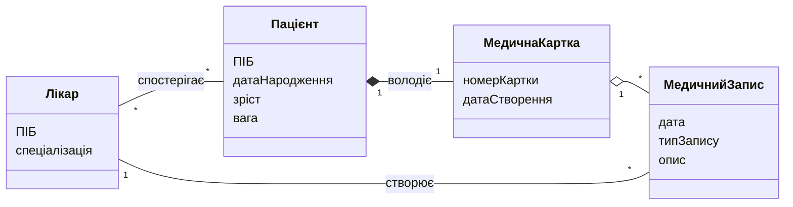

```mermaid
classDiagram
    direction LR

    class Пацієнт {
        ПІБ
        датаНародження
        зріст
        вага
    }

    class Лікар {
        ПІБ
        спеціалізація
    }

    class МедичнаКартка {
        номерКартки
        датаСтворення
    }

    class МедичнийЗапис {
        дата
        типЗапису
        опис
    }

    %% --- Зв'язки та кратність ---
    Пацієнт "1" *-- "1" МедичнаКартка : володіє
    Лікар "*" -- "*" Пацієнт : спостерігає
    МедичнаКартка "1" o-- "*" МедичнийЗапис
    Лікар "1" -- "*" МедичнийЗапис : створює

```
