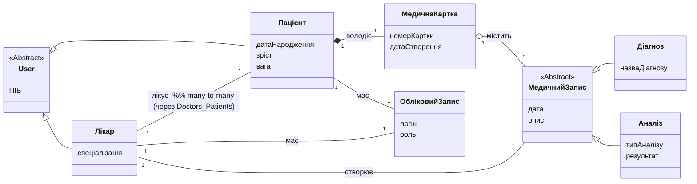

```mermaid
classDiagram
    direction LR

    class User {
        <<Abstract>>
        ПІБ
    }
    class Пацієнт {
        датаНародження
        зріст
        вага
    }
    class Лікар {
        спеціалізація
    }
    
    User <|-- Пацієнт
    User <|-- Лікар

    class МедичнаКартка {
        номерКартки
        датаСтворення
    }
    class МедичнийЗапис {
        <<Abstract>>
        дата
        опис
    }
    class Діагноз {
        назваДіагнозу
    }
    class Аналіз {
        типАналізу
        результат
    }

    МедичнийЗапис <|-- Діагноз
    МедичнийЗапис <|-- Аналіз

    class ОбліковийЗапис {
        логін
        роль
    }

    %% Зв'язки (кардинальності)
    Пацієнт "1" *-- "1" МедичнаКартка : володіє
    Пацієнт "1" -- "1" ОбліковийЗапис : має
    Лікар "1" -- "1" ОбліковийЗапис : має

    МедичнаКартка "1" o-- "*" МедичнийЗапис : містить
    Лікар "1" -- "*" МедичнийЗапис : створює
    Лікар "*" -- "*" Пацієнт : лікує  %% many-to-many (через Doctors_Patients)
```
