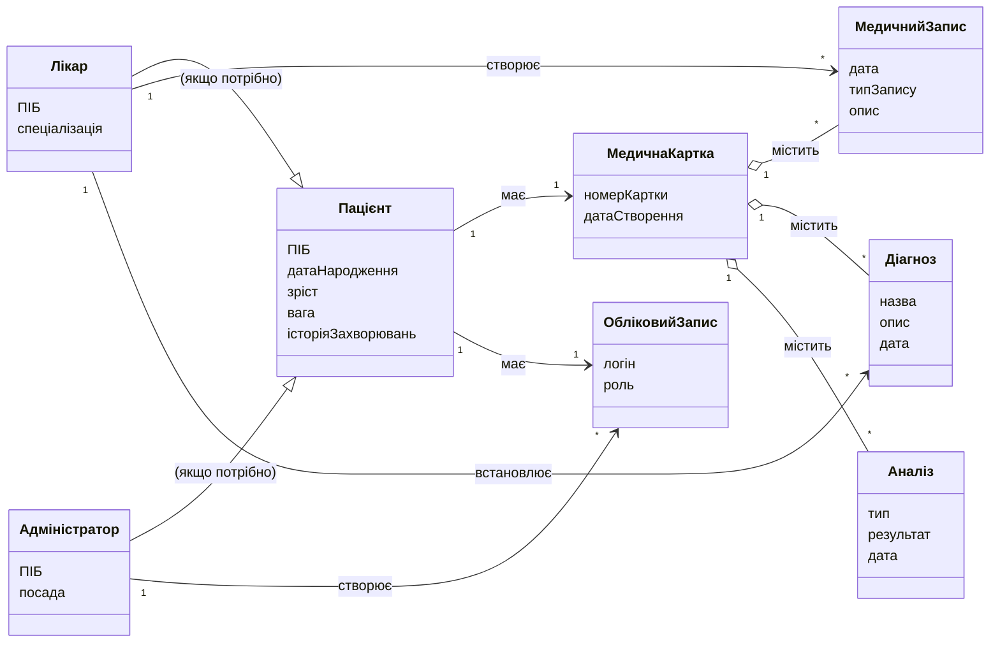

```mermaid
classDiagram
    direction LR

    class Пацієнт {
        ПІБ
        датаНародження
        зріст
        вага
        історіяЗахворювань
    }

    class Лікар {
        ПІБ
        спеціалізація
    }

    class Адміністратор {
        ПІБ
        посада
    }

    class МедичнаКартка {
        номерКартки
        датаСтворення
    }

    class МедичнийЗапис {
        дата
        типЗапису
        опис
    }

    class Діагноз {
        назва
        опис
        дата
    }

    class Аналіз {
        тип
        результат
        дата
    }

    class ОбліковийЗапис {
        логін
        роль
    }

    %% Узагальнення (User -> ролі)
    Лікар --|> Пацієнт : (якщо потрібно) 
    Адміністратор --|> Пацієнт : (якщо потрібно)

    %% Асоціації / агрегації
    Пацієнт "1" --> "1" МедичнаКартка : має
    МедичнаКартка "1" o-- "*" МедичнийЗапис : містить
    МедичнаКартка "1" o-- "*" Діагноз : містить
    МедичнаКартка "1" o-- "*" Аналіз : містить

    Лікар "1" --> "*" МедичнийЗапис : створює
    Лікар "1" --> "*" Діагноз : встановлює

    Адміністратор "1" --> "*" ОбліковийЗапис : створює
    Пацієнт "1" --> "1" ОбліковийЗапис : має
```
