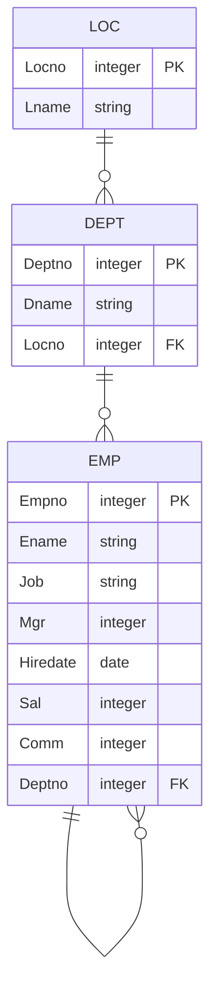

```mermaid
erDiagram
    LOC {
        Locno integer PK
        Lname string
    }

    DEPT {
        Deptno integer PK
        Dname string
        Locno integer FK
    }

    EMP {
        Empno integer PK
        Ename string
        Job string
        Mgr integer
        Hiredate date
        Sal integer
        Comm integer
        Deptno integer FK
    }

    %% Відношення (PK / FK)
    LOC ||--o{ DEPT : ""
    DEPT ||--o{ EMP : ""
    EMP ||--o{ EMP : ""
```
