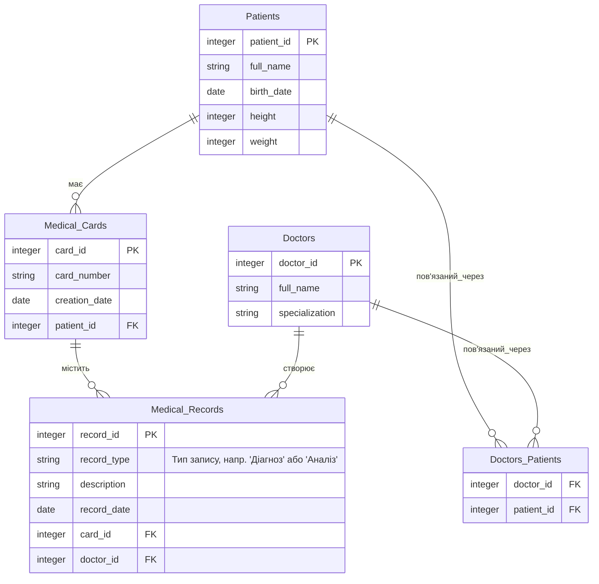

```mermaid
erDiagram
    Patients {
        integer patient_id PK
        string full_name
        date birth_date
        integer height
        integer weight
    }

    Doctors {
        integer doctor_id PK
        string full_name
        string specialization
    }

    %% Сполучна таблиця для зв'язку "багато-до-багатьох"
    Doctors_Patients {
        integer doctor_id FK
        integer patient_id FK
    }

    Medical_Cards {
        integer card_id PK
        string card_number
        date creation_date
        integer patient_id FK
    }

    Medical_Records {
        integer record_id PK
        string record_type "Тип запису, напр. 'Діагноз' або 'Аналіз'"
        string description
        date record_date
        integer card_id FK
        integer doctor_id FK
    }

    %% Зв'язки (кардинальності)
    Patients ||--o{ Medical_Cards : "має"
    Patients ||--o{ Doctors_Patients : "пов'язаний_через"
    Doctors ||--o{ Doctors_Patients : "пов'язаний_через"

    Medical_Cards ||--o{ Medical_Records : "містить"
    Doctors ||--o{ Medical_Records : "створює"
```
