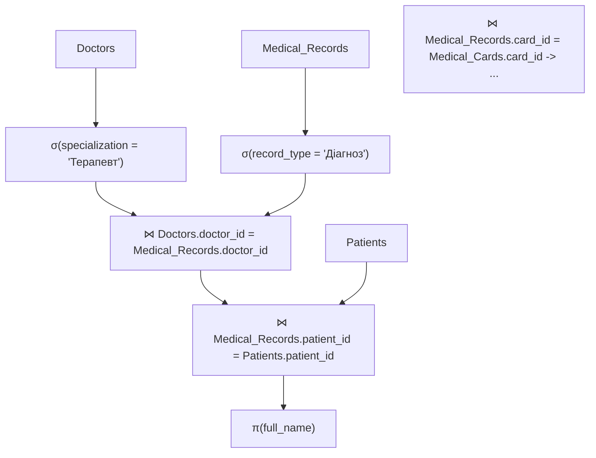

```mermaid
graph TD
    %% Джерела (таблиці з вашої БД)
    Patients[Patients]
    Doctors[Doctors]
    Medical_Records[Medical_Records]

    %% Операції вибірки (фільтрації)
    S1["&sigma;(specialization = 'Терапевт')"]
    S2["&sigma;(record_type = 'Діагноз')"]

    %% Операції з'єднання
    J1["&bowtie; Doctors.doctor_id = Medical_Records.doctor_id"]
    J2["&bowtie; Medical_Records.card_id = Medical_Cards.card_id -> ..."]
    %% Припустимо, що Medical_Records має patient_id для спрощення
    J_final["&bowtie; Medical_Records.patient_id = Patients.patient_id"]


    %% Операція проекції (вибір стовпців)
    P["&pi;(full_name)"]

    %% Потік операцій
    Doctors --> S1
    Medical_Records --> S2
    
    S1 --> J1
    S2 --> J1

    J1 --> J_final
    Patients --> J_final

    J_final --> P
```
