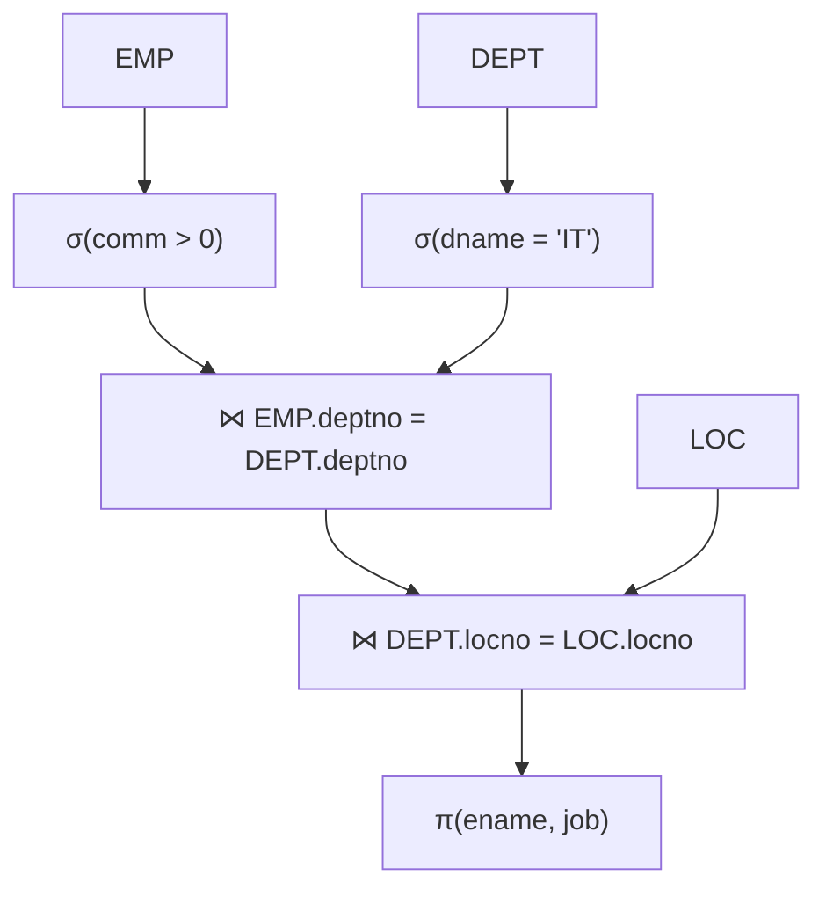

```mermaid
graph TD
  %% джерела
  EMP[EMP]
  DEPT[DEPT]
  LOC[LOC]

  %% селекції
  S1["&sigma;(comm > 0)"]
  S2["&sigma;(dname = 'IT')"]

  %% з'єднання
  J1["&bowtie; EMP.deptno = DEPT.deptno"]
  J2["&bowtie; DEPT.locno = LOC.locno"]

  %% проекція
  P["&pi;(ename, job)"]

  %% Потік операцій
  EMP --> S1
  DEPT --> S2

  S1 --> J1
  S2 --> J1

  J1 --> J2
  LOC --> J2

  J2 --> P
```
