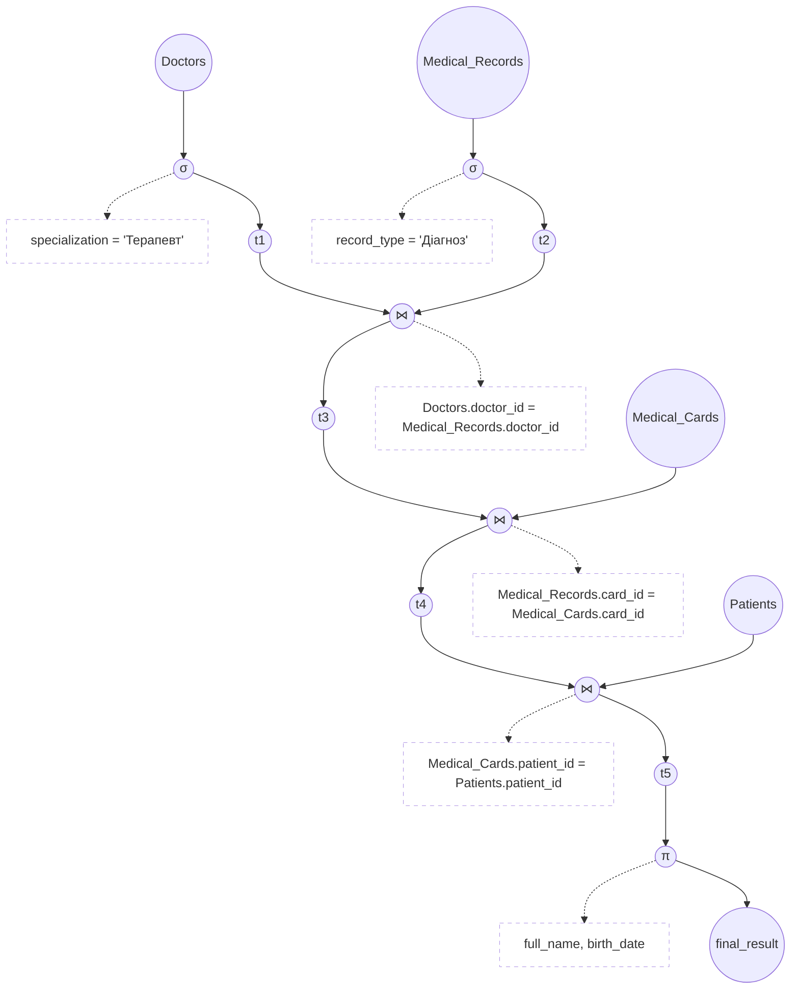

```mermaid
graph TD
    %% Стиль для вузлів-умов (пунктирний прямокутник без заливки)
    classDef operation stroke-dasharray:5 5,stroke-width:0.5px,fill:none

    %% Вхідні таблиці
    doctors_tbl((Doctors))
    med_records_tbl((Medical_Records))
    med_cards_tbl((Medical_Cards))
    patients_tbl((Patients))

    %% Гілка 1: Фільтрація лікарів за спеціалізацією
    doctors_tbl --> op1((σ))
    op1 -.-> cond1["specialization = 'Терапевт'"]:::operation
    op1 --> t1((t1))

    %% Гілка 2: Фільтрація медичних записів за типом
    med_records_tbl --> op2((σ))
    op2 -.-> cond2["record_type = 'Діагноз'"]:::operation
    op2 --> t2((t2))

    %% Перше з'єднання: відфільтровані лікарі та їх записи-діагнози
    t1 --> op3((⋈))
    t2 --> op3
    op3 -.-> cond3["Doctors.doctor_id = Medical_Records.doctor_id"]:::operation
    op3 --> t3((t3))

    %% Друге з'єднання: результат з медичними картками
    t3 --> op4((⋈))
    med_cards_tbl --> op4
    op4 -.-> cond4["Medical_Records.card_id = Medical_Cards.card_id"]:::operation
    op4 --> t4((t4))

    %% Третє з'єднання: результат з пацієнтами
    t4 --> op5((⋈))
    patients_tbl --> op5
    op5 -.-> cond5["Medical_Cards.patient_id = Patients.patient_id"]:::operation
    op5 --> t5((t5))

    %% Фінальна проекція: отримання ПІБ та дати народження пацієнтів
    t5 --> op6((π))
    op6 -.-> cond6["full_name, birth_date"]:::operation
    op6 --> result((final_result))
```
