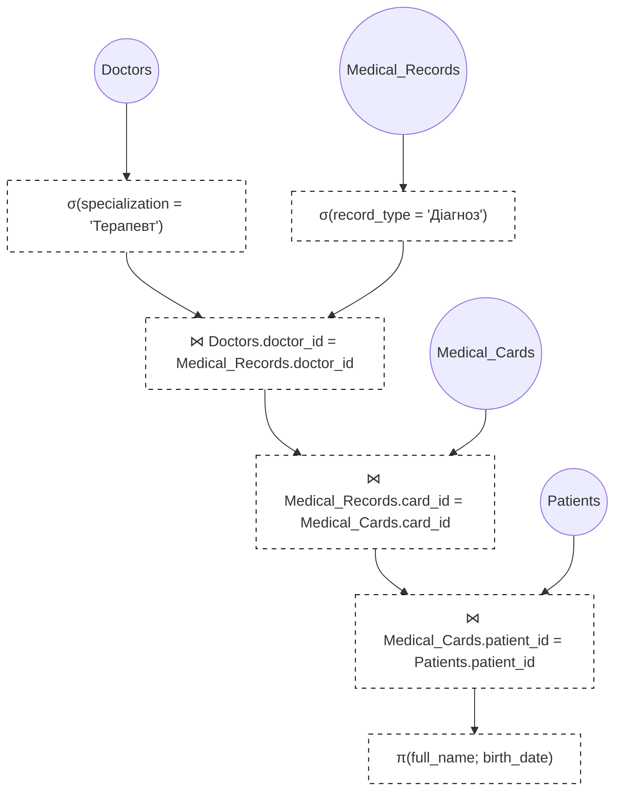

```mermaid
graph TD
    %% Джерела (таблиці) — оформлені як овали
    Patients((Patients))
    Doctors((Doctors))
    Medical_Records((Medical_Records))
    Medical_Cards((Medical_Cards))

    %% Операції - прямокутники (пунктирні, без заливки)
    S1["σ(specialization = 'Терапевт')"]
    S2["σ(record_type = 'Діагноз')"]

    %% З'єднання (в кілька кроків — в сумі три таблиці з'єднуються)
    J1["⋈ Doctors.doctor_id = Medical_Records.doctor_id"]
    J2["⋈ Medical_Records.card_id = Medical_Cards.card_id"]
    J3["⋈ Medical_Cards.patient_id = Patients.patient_id"]

    %% Операція проекції (дві колонки з однієї таблиці — запис коментарем на окремому рядку)
    P["π(full_name; birth_date)"]
    %% дві колонки з однієї таблиці (Patients)

    %% Потік операцій
    Doctors --> S1
    Medical_Records --> S2

    S1 --> J1
    S2 --> J1

    J1 --> J2
    Medical_Cards --> J2

    J2 --> J3
    Patients --> J3

    J3 --> P

    %% Присвоюємо клас операціям (щоб стилізувати)
    class S1,S2,J1,J2,J3,P op;

    %% Стиль: пунктирна обводка, без заповнення
    classDef op stroke:#000,stroke-width:1px,fill:none,stroke-dasharray:5 5;

```
